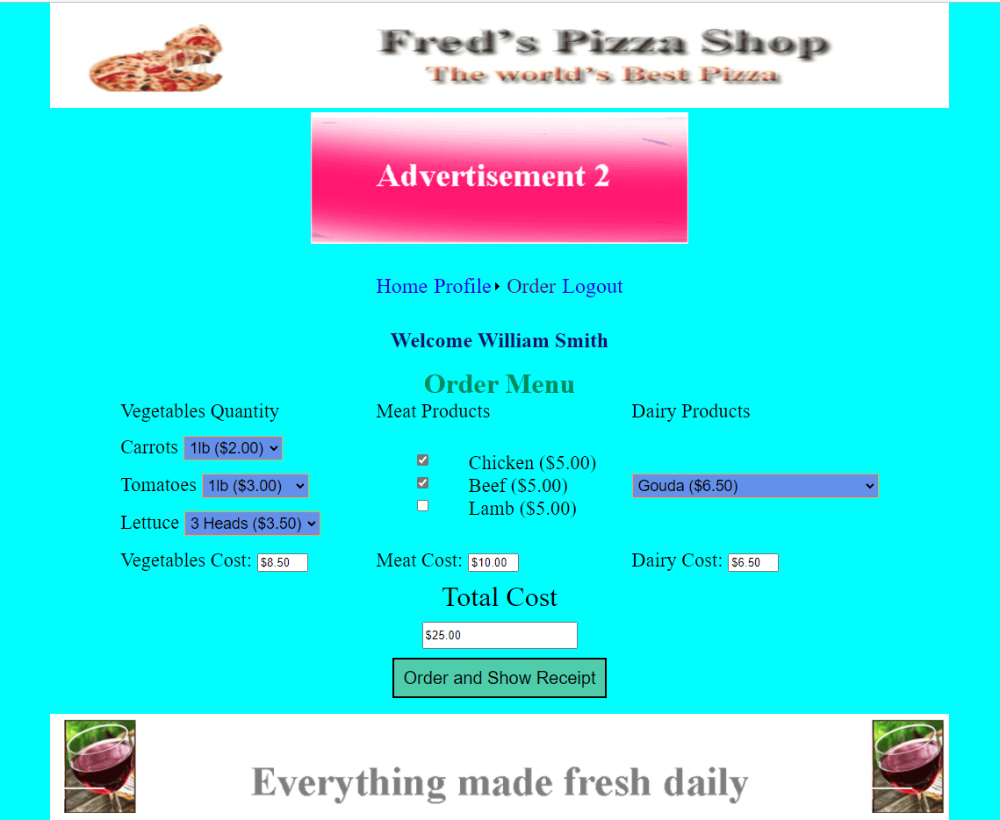
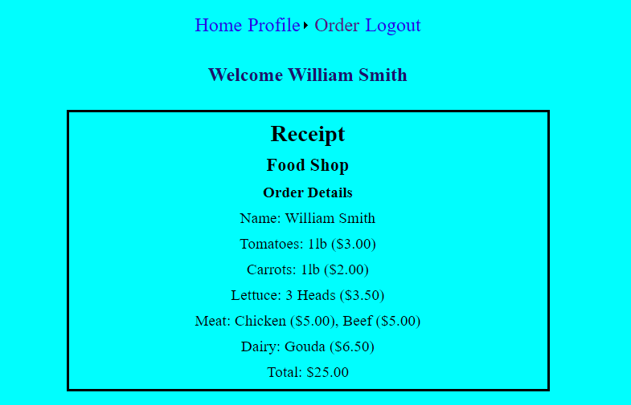
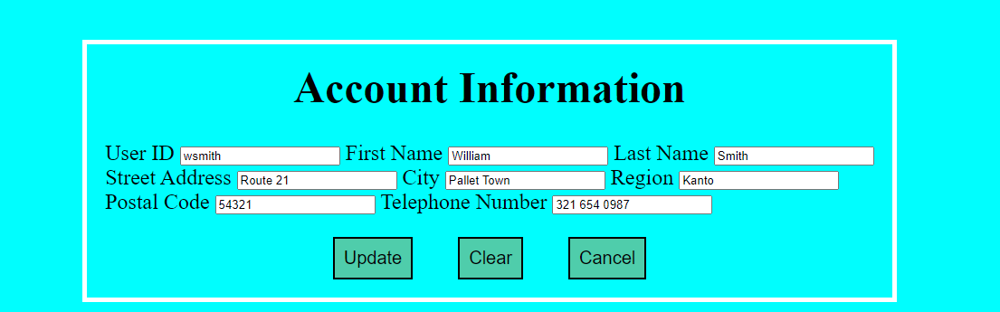

# Shop Simulation

A simple app built with ASP.NET 4.7 Webforms to simulate a user accessing a shop

## Technologies
  - C#
  - ASP.NET
  - Web Forms (Master Pages)
  - CSS

## Application Information
This is an app which is simulating a shopping experience for a user. The app
has fixed values as there is no database being used. There is also an "advertisement"
that changes every time the page is refreshed.

### Solutions and Architecture

When the app starts up, the user is prompted to enter their credentials:

After logging in with the correct credentials, the user is taken to the 
Order Screen where they can order several items and are shown the price based 
on their selections. The prices are updated whenever a change is made.

After selecting items, they can click the view receipt button to view the 
totals of the items purchased

The navigation bar has options to take you to a landing page or change profile
information:

There is also a navigation menu item to log out of the application which takes you
to a screen that confirms logout and has a button to return to the login screen:

### Lessons Learned

I learned about managing state and how pages are constructed in webforms. I gained more experience and feel
more comfortable with C# after completing this project. I will certainly be looking into how I can use C#
in a full stack application, the idea being .Net with React.

